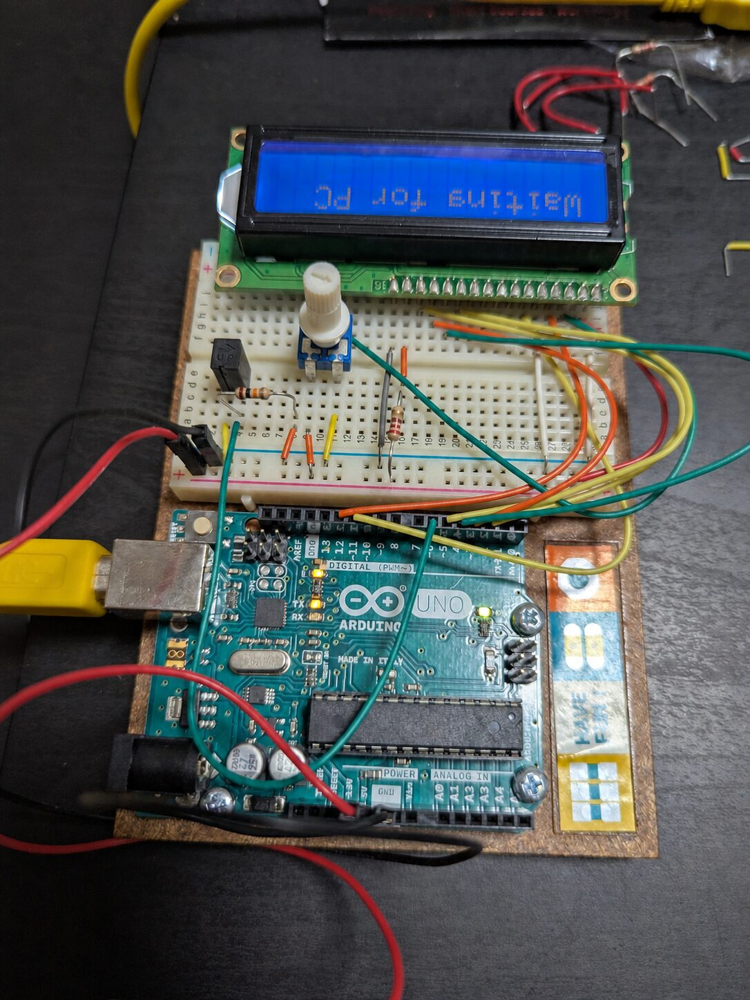
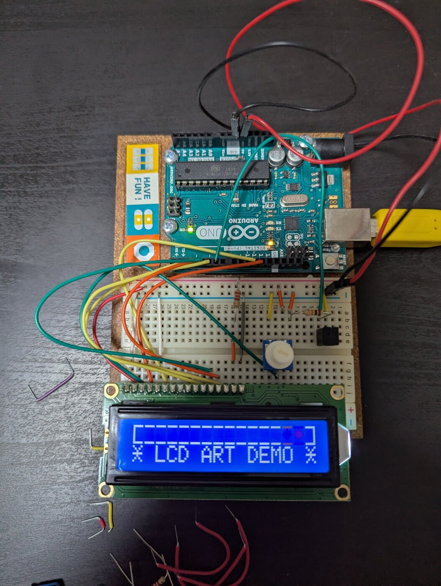

# Arduino Starter Kit Examples

This directory contains the Arduino UNO R3 examples for Circuit Foundry. The sketches are ordered from basic board bring-up to a more expressive LCD demo.



## Hardware

Baseline board:

- Arduino UNO R3
- USB cable for power, upload, and serial monitor
- Arduino CLI with FQBN `arduino:avr:uno`

LCD examples:

- HD44780-compatible 16x2 LCD
- Breadboard and jumper wires
- Contrast potentiometer
- Current-limiting/backlight wiring appropriate for the LCD module
- `LiquidCrystal` Arduino library

Common LCD data/control wiring used by the sketches:

```text
RS -> 12
E  -> 11
D4 -> 5
D5 -> 4
D6 -> 3
D7 -> 2
```

## Sketches

| Sketch | Start Here When | Expected Behavior |
| --- | --- | --- |
| `HelloWorldSketch` | You only need to prove the board can run a sketch. | Built-in LED turns on for 1 second, then off for 0.5 seconds. |
| `UnoR3Test` | You want observable LED and serial verification. | Built-in LED blinks and serial monitor prints `LED on` / `LED off`. |
| `LcdDisplayTest` | You wired the 16x2 LCD and want a deterministic display test. | LCD shows `Arduino UNO R3` and an updating uptime line; serial logs row verification. |
| `LcdExecutiveArtDemo` | You want the polished proof-of-concept demo. | LCD cycles through animated signal, wave, precision, and finale scenes using custom glyphs. |

## Compile

Compile each sketch with an explicit build path:

```sh
arduino-cli compile --fqbn arduino:avr:uno --build-path /tmp/arduino-hello-world-build arduino_starter_kit/HelloWorldSketch
arduino-cli compile --fqbn arduino:avr:uno --build-path /tmp/arduino-uno-r3-test-build arduino_starter_kit/UnoR3Test
arduino-cli compile --fqbn arduino:avr:uno --build-path /tmp/arduino-lcd-display-test-build arduino_starter_kit/LcdDisplayTest
arduino-cli compile --fqbn arduino:avr:uno --build-path /tmp/arduino-lcd-executive-art-demo-build arduino_starter_kit/LcdExecutiveArtDemo
```

You can also use the skill helper from the repository root:

```sh
skills/arduino-sketch-workflow/scripts/arduino_cli_workflow.sh compile arduino_starter_kit/LcdDisplayTest
```

## Upload And Monitor

Discover the board port:

```sh
arduino-cli board list
```

Upload a compiled sketch:

```sh
arduino-cli upload -p /dev/ttyACM0 --fqbn arduino:avr:uno --input-dir /tmp/arduino-lcd-display-test-build arduino_starter_kit/LcdDisplayTest
```

Open the serial monitor:

```sh
arduino-cli monitor -p /dev/ttyACM0 -b arduino:avr:uno -c baudrate=9600
```

Use the actual serial port from `arduino-cli board list` if your board appears somewhere other than `/dev/ttyACM0`.

## LCD Demo Proof

The art demo uses the LCD's eight custom-character slots to swap glyph sets between scenes.



## Notes

- Keep each sketch in a folder whose name matches the `.ino` file.
- Compile with a `/tmp` build path when running in restricted or sandboxed environments.
- If LCD text appears as blocks or is not visible, adjust the contrast potentiometer first.
- If serial output starts mid-line, close and reopen the monitor after the board reset completes.
